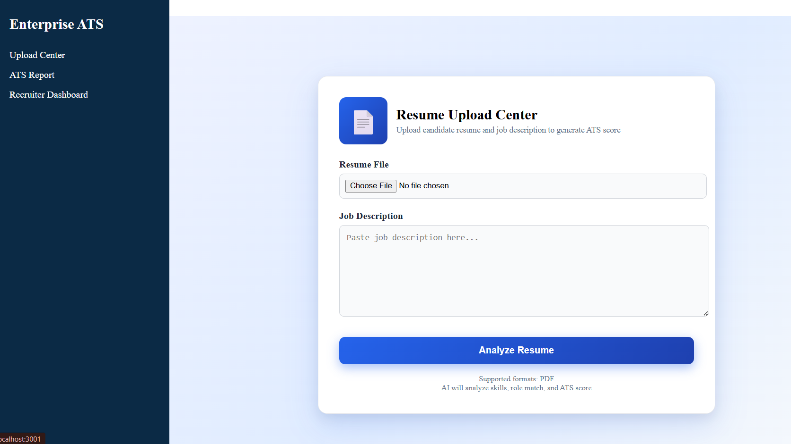
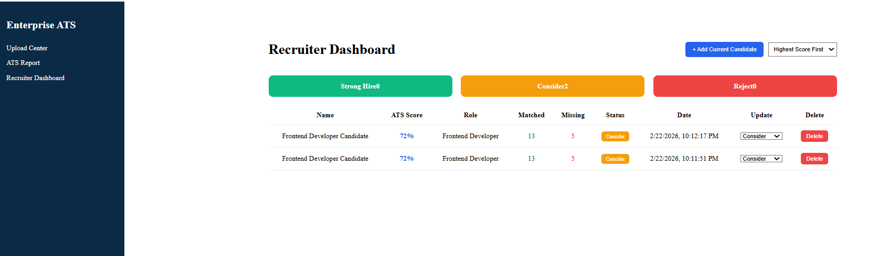

# ATS Resume Analyzer

An enterprise-level Applicant Tracking System (ATS) Resume Analyzer built using React, Django REST Framework, and NLP. This system analyzes resumes against job descriptions, calculates ATS scores, predicts job roles, and provides a recruiter dashboard for candidate management.

---

## Features

- ATS score calculation based on job description
- Skill extraction using NLP (spaCy)
- Role prediction engine
- Matched and missing skills analysis
- Professional ATS report with charts
- Recruiter dashboard with candidate pipeline
- Add, update, and delete candidates
- Persistent database storage
- PDF export of ATS report

---

## Screenshots

### Upload Center


### ATS Report Dashboard


### Recruiter Dashboard


---

## Tech Stack

**Frontend**
- React.js
- JavaScript
- CSS
- Recharts

**Backend**
- Django
- Django REST Framework
- Python

**NLP**
- spaCy
- Custom Skill Extraction Engine

**Database**
- SQLite (Development)
- PostgreSQL (Production Ready)

---

## Installation

### Backend

```bash
cd backend
python -m venv venv
venv\Scripts\activate
```
### Frontend
```bash
cd frontend
npm install
npm start
---

## API Endpoints

| Method | Endpoint | Description |
|-------|----------|-------------|
| POST | /api/upload/ | Upload resume and calculate ATS score |
| GET | /api/candidates/ | Fetch all candidates |
| POST | /api/candidates/add/ | Save candidate to database |
| PUT | /api/candidates/{id}/update/ | Update candidate status |
| DELETE | /api/candidates/{id}/delete/ | Delete candidate |

---


## Author

**Shreya V K**
GitHub: https://github.com/ShreyaVK28
pip install -r requirements.txt
python manage.py migrate
python manage.py runserver
